# Week 11 Development: Creative Tasks and MineCLIP Evaluation

## Scope

Week 11 adds the creative-task path without changing the Week 10 online runtime boundary:

- Mineflayer remains the only online game runtime used by the agent.
- All 1,560 official MineDojo creative task descriptions are imported into executable manifests.
- The agent receives the creative goal and the normal harness action/knowledge/skill context.
- After `submit_for_evaluation`, the harness packages final video/screenshot evidence for human review.
- Human review is the only authoritative creative-task result; MineCLIP never declares success.
- Optional online MineCLIP feedback exposes only low-confidence score deltas/trends in later observations.

```mermaid
flowchart LR
    T["MineDojo creative manifest"] --> H["Harness ReAct loop"]
    H --> W["Mineflayer worker"]
    W --> M["Minecraft server"]
    M --> V["Agent first-person recording"]
    V --> F["ffmpeg frame sampler"]
    F --> C["Isolated official MineCLIP service"]
    C --> E["Non-authoritative automatic evaluation"]
    E --> D["Human review evidence bundle"]
    D --> R["Approve / Reject / Revision / Inconclusive"]
    C -. "optional asynchronous trend" .-> H
```



## Agent-Requested Finish

Creative runs no longer need to wait exclusively for `max_steps` or `max_runtime`. Once the model has concrete completion evidence, it may call `submit_for_evaluation`:

1. The harness records `agent_finish_requested` but does not treat the model's belief as success.
2. The online ReAct loop stops with `agent_submitted_for_external_evaluation` and selects no further Minecraft actions.
3. After recording stops, MineCLIP produces auxiliary scores and key-frame evidence.
4. The run enters `awaiting_human_review`; a reviewer makes the authoritative decision.
5. `max_steps` and `max_runtime` remain independent safeguards when the agent never submits.

`submit_for_evaluation` is a harness control action and is never sent to the Mineflayer worker. It freezes the available trajectory for authoritative external evaluation; it does not declare that the creative task succeeded.

## Authentic Task Snapshot

The source is pinned to MineDojo revision `2731bc27394269643b43828d9db8ab3a364601f0`:

- Source: `tasks/sources/minedojo/creative_tasks.yaml`
- Source SHA-256: `609ce47189e1b94407820c5b0f79b9ea241682bbfd897ecdb63e756efdbcac66`
- Executable output: `tasks/executable/minedojo_creative_tasks.jsonl`
- Total: 1,560 tasks
- Collections: 216 manual, 1,042 YouTube, 302 GPT-3

Regenerate the snapshot deterministically:

```bash
make import-week11-creative
make validate-schemas
```

Each manifest preserves the official `prompt`, `guidance`, `collection`, and `source`. Guidance is marked `metadata_only_not_auto_prompted`; it does not leak a reference solution into the execution prompt. The adapter adds deterministic contrast prompts, a 16-frame sampling policy, and pending calibration metadata.

## Creative Category Is Not Creative Mode

MineDojo uses `Creative` as a task category, not Minecraft's `creative` game mode. The official `CreativeMeta` constructor accepts initial inventory, spawn state, health, food, weather, and image size, but exposes no `game_mode` argument. `minedojo.make("creative:<id>")` only constructs that task type, and the documented command allowlist does not include `gamemode`.

The aligned harness policy is therefore explicit:

- Every creative manifest declares `reset_plan.game_mode=survival`.
- RCON reset runs `/gamemode survival <bot>` and clears inventory and dropped items.
- `initial_inventory=[]` remains the default unless an experiment explicitly configures items.
- Any future creative-mode demo must be labeled as a non-aligned demo/ablation and excluded from formal results.

Primary references: [CreativeMeta source](https://docs.minedojo.org/_modules/minedojo/tasks/meta/creative/creative.html), [task make source](https://docs.minedojo.org/_modules/minedojo/tasks.html), and [simulation customization](https://docs.minedojo.org/sections/customization/sim.html).

## Components

- `minedojo_creative_adapter.py`: authentic YAML to executable manifest conversion.
- `creative.py`: trajectory window sampling, score aggregation, key-frame selection, and audit events.
- `mineclip.py`: bounded asynchronous HTTP adapter; Torch never enters the backend process.
- `progress.py`: continuous low-rate ring buffer, important-action checkpoints, serialized asynchronous scoring, and observation injection.
- `video.py`: ffmpeg extraction at 256x160 RGB and configured sample FPS.
- `macos_window_capture.py`: strict CoreGraphics selection of a real layer-0 Minecraft window, with Finder/terminal false-positive rejection and pre/post capture evidence.
- `visual_snapshot.py`: backend interception of `request_visual_snapshot`; the next Qwen turn receives a real multimodal frame while audit stores only path, dimensions, and SHA-256.
- `video.py` also validates MP4 duration, dimensions, codec, and decodability through ffprobe.
- `calibration.py`: deterministic one-dimensional K=2 calibration with centroid-midpoint threshold.
- `services/mineclip-scorer/`: isolated FastAPI process that loads official MineCLIP code and weights.
- `creative_evaluations`: query-friendly SQL table containing score, threshold, status, trend, and key frames.
- `human_reviews`: review state, evidence bundle, reviewer, reason, notes, and optimistic-lock version.
- Dashboard `Review` section: task name and final media first, with the complete ReAct trajectory loaded only when expanded.

MineCLIP consumes exactly 16 frames. The harness creates overlapping windows (default stride 8), uniformly caps long trajectories at 64 windows, and uses the mean target probability as the trajectory score. Key frames are the center frames of the highest-scoring windows.

## MineCLIP Setup

The research model is isolated because its Torch stack should not constrain the backend environment. The setup script pins official MineCLIP commit `e6c06a0245fac63dceb38bc9bd4fecd033dae735`.

```bash
make mineclip-scorer-setup
```

The setup script downloads `attn` directly from the URL published by the upstream [MineCLIP repository](https://github.com/MineDojo/MineCLIP), verifies the official MD5, and prefetches the CLIP tokenizer. Weights, caches, and generated absolute-path configuration remain Git-ignored and are not redistributed.

Verify the managed scorer lifecycle and one real 16-frame forward pass:

```bash
make mineclip-scorer-start
make mineclip-scorer-status
make mineclip-scorer-smoke
make mineclip-scorer-stop
```

Local audit evidence shows roughly 2.7 seconds for the first cold inference and about 0.21-0.25 seconds for warmed consecutive windows. Capturing 16 new frames after an action would still take about eight seconds at 2 FPS, so online feedback uses a continuous ring buffer and never blocks action RPC.

## Human Review

An accepted creative submission follows this state machine:

```text
running -> awaiting_human_review
        -> approved | rejected | revision_requested | inconclusive
```

The review page shows the task name and complete first-person video, falling back to a terminal screenshot. MineCLIP is intentionally absent from the primary decision surface to reduce label anchoring. Reviewers can expand the complete prompt/observation/decision/action/result trajectory.

The API exposes `/api/human-reviews`, guarded `/video` and `/image` resources, and `POST /api/human-reviews/{run_id}/decision`. Decisions include `expected_version`; stale concurrent submissions receive HTTP 409. Every accepted decision emits `human_review_decided`. MineCLIP verifier events are persisted with `authoritative=false` and cannot overwrite the human result.

Apply migration `0004_week11_human_reviews.py` with:

```bash
make migrate-db
```

## Online MineCLIP Progress Feedback

This functionality stays in a harness runtime decorator, not the Node worker. After creative reset, a trusted-window sampler keeps a 64-frame in-memory ring buffer at 2 FPS. Successful `place_block`, `dig_block_at`, and `use_item` actions queue checkpoints by default. The action immediately returns `creative_progress_job.status=queued` with `blocking=false`; a single background scorer later writes the latest advisory result into `observation.creative_progress`.

The model receives `score`, `score_delta`, `trend`, `confidence=low`, `advisory_only=true`, and `success_authority=human_review`. These values measure relative video/text alignment and never prove correctness or terminate a task. Queue bounds, checkpoint spacing, and coalescing prevent local scoring from delaying agent execution.

Enable it explicitly on the live runner:

```bash
--mineclip-progress-feedback \
--recording-window-title Minecraft \
--mineclip-progress-scorer-url http://127.0.0.1:8091
```

`scripts/run_week11_local_creative.sh` starts the scorer during live execution and enables this path by default. Pass `--no-mineclip-progress-feedback` for an ablation run.

## End-to-End Creative Run

The current capture path reuses the existing visible Minecraft client and spectator follow because Mineflayer does not provide native RGB observations. Keep the client visible, connect the spectator player, and run:

```bash
export MINECRAFT_RCON_PASSWORD=<PASSWORD>
export QWEN_API_KEY=<KEY>
export MC_AGENT_SPECTATOR_PLAYER=flysnow_chen

make week11-local-creative
```

The local profile starts or reuses one Minecraft server, then waits up to 300 seconds for RCON `/list` to confirm `MC_AGENT_SPECTATOR_PLAYER` has joined. The client can remain at the multiplayer screen until the command starts the server. It then runs one automatically managed Mineflayer worker and executes the backend runner in-process. Spectator follow waits until reset has committed `run_started`, then detaches the stale camera, teleports the client beside the bot, waits `MC_AGENT_SPECTATOR_CHUNK_SYNC_DELAY_SEC` (default `0.75` seconds), and attaches the camera. Rebind attempts are persisted as `spectator_follow_attempt` events. The current local profile keeps MineCLIP available during live execution for asynchronous progress feedback and stops it from shell cleanup. A server started by this command is cleaned up on success, failure, or interruption; a pre-existing server is preserved. Set `MC_AGENT_STOP_SERVER_AFTER_RUN=0` to keep a newly started server. Append options such as `--task-id 'creative:21'` directly to `scripts/run_week11_local_creative.sh`.

Omit `--task-id` to choose a reproducible random creative task from `--seed`. The wrapper writes `live_training.json`, `audit.sqlite3`, `agent_pov.mp4`, extracted frames, `creative_evaluation.json`, and `workflow_summary.json` under one `runs/week11/...` directory. It writes MineCLIP events back to the same run ID and database.

Recording now has a fail-closed validity gate. A direct Minecraft-window preflight must pass before workers or remote model calls begin; a postflight capture and ffprobe check run after execution. MineCLIP starts only when `validation.valid=true` and `trusted_minecraft_window=true`. Otherwise the workflow records `creative_evaluation_inconclusive` instead of scoring Finder, the desktop, or wallpaper. A model-requested visual frame is attached only to the next model turn, not to every observation.

To inspect that standalone SQLite run in the dashboard, point the backend at the generated file and keep artifacts under the repository `runs` root:

```bash
scripts/start_week11_audit_backend.sh
./scripts/dev-frontend.sh
```

For the normal PostgreSQL deployment, run `make migrate-db` and pass the shared URL through the wrapper's `--database-url` option.

For an existing recording:

```bash
PYTHONPATH=backend/src backend/.venv/bin/python scripts/run_week11_creative_evaluation.py \
  --task-id 'creative:21' \
  --video runs/demo/agent_pov.mp4 \
  --scorer-url http://127.0.0.1:8091 \
  --output-dir runs/week11/offline_eval
```

## Calibration

Thresholds are task-specific and calibrated from trajectory-level scores. They support offline analysis, ranking, and human/MineCLIP agreement experiments; they do not decide creative-task success. Human review remains authoritative. JSONL input rows use:

```json
{"task_id":"creative:21","score":0.63,"human_success":true}
```

Fit and merge a threshold after collecting at least 20 varied examples; 200 is the recommended experiment target:

```bash
PYTHONPATH=backend/src backend/.venv/bin/python scripts/calibrate_week11_mineclip.py \
  --task-id 'creative:21' \
  --examples-jsonl runs/week11/calibration_examples.jsonl \
  --output configs/creative_mineclip_calibration.json
```

`--threshold` on the evaluation CLI exists for controlled smoke tests only. It should replace neither a reviewed calibration registry nor the authoritative human decision.

## Audit Contract

The evaluator and human-review workflow emit:

- `creative_evaluation_started`: prompt, contrast set, frame/window count, policy, calibration, visibility boundary.
- `creative_frame_window_scored`: frame range, target probability, logits/probabilities, model variant, checkpoint checksum, latency.
- `creative_evaluation_completed`: trajectory mean, non-authoritative threshold comparison, score trend, key frames, checks.
- `creative_evaluation_inconclusive`: missing frames, scorer failure, or missing authoritative evidence.
- `mineclip_progress_requested`: a non-blocking important-action checkpoint or coalescing reason.
- `mineclip_progress_feedback`: the first later observation containing score, delta, trend, and scorer metadata.
- `human_review_decided`: authoritative reviewer identity, decision, reasons, notes, and version.

Private media paths remain in SQL for artifact ownership. Dashboard responses remove them and expose guarded `/api/creative-evaluations/{run_id}/frames/{index}` and `/api/human-reviews/{run_id}/video|image` URLs restricted to allowlisted media under `ARTIFACT_ROOT`.

## Verification

```bash
backend/.venv/bin/python -m pytest -q \
  backend/tests/unit/test_minedojo_creative_adapter.py \
  backend/tests/unit/test_creative_evaluation.py \
  backend/tests/unit/test_creative_persistence.py \
  backend/tests/unit/test_dashboard_creative_api.py \
  backend/tests/unit/test_creative_progress_feedback.py \
  backend/tests/unit/test_human_review_api.py \
  backend/tests/unit/test_week11_creative_cli.py

make validate-schemas
cd frontend && npm run build
```

## Local Acceptance Record

The following real checks passed on 2026-07-13 on an Apple M5 with 10 CPU cores and 32GB unified memory:

- The official roughly 605MiB `attn.pth` downloaded with MD5 `b5ece9198337cfd117a3bfbd921e56da`.
- MPS completed both the generated 16-frame smoke and frame extraction/scoring from an existing Minecraft MP4.
- One real-video window took about 2.73 seconds and retained device, checksum, logits, probabilities, and latency evidence.
- One Minecraft 1.20.1/Fabric server ran with `-Xmx2500M`; game port 25565, RCON 25575, and authenticated `/list` all passed.
- One Mineflayer worker and the backend RPC completed `reset -> observe -> query_inventory -> snapshot -> close`.
- 212 backend tests, worker and frontend typechecks, the frontend build, and validation of 3,141 executable manifests passed.
- No server, worker, backend, or scorer process remained after acceptance cleanup.

The unattended check intentionally did not start a full LLM creative run because first-person capture requires a visible Minecraft client player. Once the client joins, `make week11-local-creative` enters that final live path.

## Current Boundary

Code, manifests, audit persistence, UI, calibration, and the end-to-end command are implemented. The official `attn` checkpoint is installed locally and has passed a real MPS inference smoke test. First-person capture still requires a visible Minecraft client; a server-side/headless renderer remains a later infrastructure improvement for cloud-scale creative evaluation.
