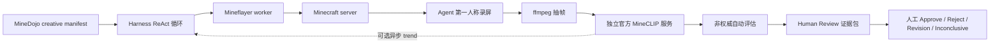

# Week11 开发文档：Creative Task 与 MineCLIP 评测

## 本周范围

Week11 在不改变 Week10 在线执行边界的前提下补齐 creative task 链路：

- Mineflayer 仍然是 agent 唯一的在线游戏 runtime。
- 导入 MineDojo 官方全部 1,560 条 creative task。
- agent 只接收 creative goal，以及原有的动作、知识工具、skill 和记忆上下文。
- agent 调用 `submit_for_evaluation` 后，harness 生成视频/终态截图证据包并进入人工审核队列。
- 人工审核是 creative task 成功与否的唯一权威来源；MineCLIP 不会直接宣布成功。
- 可选的在线 MineCLIP 过程反馈只返回 `score_delta/trend`，作为后续 observation 中的低置信度参考。



## Agent 主动结束

Creative task 不再只能等待 `max_steps` 或 `max_runtime` 耗尽。模型在有具体完成证据时可调用 `submit_for_evaluation`：

1. Harness 记录 `agent_finish_requested`，但不把模型的判断当成 success。
2. 在线 ReAct 循环以 `agent_submitted_for_external_evaluation` 结束，停止选择新的 Minecraft action。
3. 录屏结束后抽取整条轨迹的重叠 16 帧窗口，MineCLIP 生成辅助分数与关键帧。
4. run 进入 `awaiting_human_review`，由审核人根据视频或终态截图作出权威裁决。
5. 若 agent 不主动提交，`max_steps`、`max_runtime` 仍会结束 run，避免无限循环。

`submit_for_evaluation` 是 harness control action，不会发送到 Mineflayer worker。它只冻结当前轨迹供外部评估，不代表 creative task 已经成功。

## 官方任务快照

数据固定在 MineDojo revision `2731bc27394269643b43828d9db8ab3a364601f0`：

- 源文件：`tasks/sources/minedojo/creative_tasks.yaml`
- SHA-256：`609ce47189e1b94407820c5b0f79b9ea241682bbfd897ecdb63e756efdbcac66`
- 可执行快照：`tasks/executable/minedojo_creative_tasks.jsonl`
- 总数：1,560
- 来源分布：manual 216、YouTube 1,042、GPT-3 302

可重复生成并校验：

```bash
make import-week11-creative
make validate-schemas
```

每条 manifest 保留官方的 `prompt`、`guidance`、`collection` 和 `source`。其中 `guidance` 被明确标为 `metadata_only_not_auto_prompted`，不会把参考解法泄露给 agent。适配器只新增确定性的对比 prompt、16 帧采样策略和待校准元数据。

## Creative 类别不等于创造模式

MineDojo 的 `Creative` 是任务分类，不是 Minecraft `creative` gamemode。官方 `CreativeMeta` 构造参数允许设置初始背包、出生位置、生命值、饥饿值、天气和画面尺寸，但没有 `game_mode` 参数；`minedojo.make("creative:<id>")` 只是创建该任务类型。官方受限命令列表也不包含 `gamemode`。

因此本项目的对齐策略是：

- 所有 creative manifest 显式声明 `reset_plan.game_mode=survival`。
- 每次 RCON reset 执行 `/gamemode survival <bot>`、清空背包和掉落物。
- `initial_inventory=[]` 是默认值；只有实验显式配置初始物品时才改变。
- 若未来加入创造模式演示，必须标记为非 MineDojo 对齐的 demo/ablation，不能计入正式结果。

官方依据：[CreativeMeta 源码](https://docs.minedojo.org/_modules/minedojo/tasks/meta/creative/creative.html)、[task make 源码](https://docs.minedojo.org/_modules/minedojo/tasks.html)、[simulation customization](https://docs.minedojo.org/sections/customization/sim.html)。

## 工程组件

- `minedojo_creative_adapter.py`：将官方 YAML 转为 harness executable manifest。
- `creative.py`：时间窗口采样、轨迹聚合、关键帧选择和审计事件。
- `mineclip.py`：有请求大小限制的异步 HTTP adapter；后端进程不加载 Torch。
- `progress.py`：持续低帧率环形缓冲、重要动作 checkpoint、串行异步评分和 observation 注入。
- `video.py`：通过 ffmpeg 抽取 256x160 RGB 帧。
- `macos_window_capture.py`：通过 CoreGraphics 锁定真实 layer-0 Minecraft 窗口，拒绝 Finder/终端等同名窗口，并保存前后置截图证据。
- `visual_snapshot.py`：在 backend 截获 `request_visual_snapshot`，生成真实帧；下一轮以 Qwen 兼容的多模态消息注入，审计只保存路径、尺寸和 SHA-256。
- `video.py` 还会通过 ffprobe 校验 MP4 时长、尺寸、codec 和可解码性。
- `calibration.py`：确定性一维 K=2 聚类，以两个质心中点作为阈值。
- `services/mineclip-scorer/`：独立 FastAPI 进程，加载官方 MineCLIP 代码和权重。
- `creative_evaluations`：保存 score、threshold、状态、趋势和关键帧的 SQL 表。
- `human_reviews`：保存人工审核状态、证据包、审核人、原因、备注和乐观锁版本。
- 前端 `Review` 页面：主视图只展示 task name、终态视频/截图和审核命令；完整 ReAct 轨迹按需展开。

MineCLIP 每次严格接收 16 帧。Harness 默认使用 stride 8 的重叠窗口；长轨迹均匀采样至最多 64 个窗口，最终分数是各窗口目标概率的均值。关键帧取最高分窗口的中心帧。

## 安装 MineCLIP

MineCLIP 使用独立环境，避免研究模型的 Torch 依赖影响主后端。安装脚本固定官方 MineCLIP commit `e6c06a0245fac63dceb38bc9bd4fecd033dae735`：

```bash
make mineclip-scorer-setup
```

脚本会从官方 [MineCLIP 仓库](https://github.com/MineDojo/MineCLIP) README 给出的 Google Drive 地址直接下载 `attn` checkpoint，校验 MD5，并预取 CLIP tokenizer。权重、缓存和生成的绝对路径配置都在 Git 忽略目录内，本项目不会重新分发权重。

手工验证 scorer 生命周期：

```bash
make mineclip-scorer-start
make mineclip-scorer-status
make mineclip-scorer-smoke
make mineclip-scorer-stop
```

服务会核对官方 checkpoint MD5。`smoke` 会实际执行一次 16 帧视频编码和文本对比，不只是检查 HTTP。本机历史审计显示首次冷推理约 2.7 秒，预热后的连续单窗口通常约 0.21-0.25 秒。按 2 FPS 在动作后重新采满 16 帧仍需要约 8 秒，因此在线反馈必须使用持续环形缓冲并异步执行，不能阻塞动作 RPC。

## Human-in-the-loop 审核

`submit_for_evaluation` 接受后状态机为：

```text
running -> awaiting_human_review
        -> approved | rejected | revision_requested | inconclusive
```

审核证据默认包含完整第一人称视频；视频不可用时回退到终态截图。页面刻意不把 MineCLIP 分数放在主审查视图，避免人工标签被自动分数锚定。审核人可以展开完整轨迹，查看每轮 prompt、observation、decision、action 和 result。

审核 API：

- `GET /api/human-reviews`
- `GET /api/human-reviews/{run_id}`
- `GET /api/human-reviews/{run_id}/video`
- `GET /api/human-reviews/{run_id}/image`
- `POST /api/human-reviews/{run_id}/decision`

决策请求携带 `expected_version`；并发审核者提交旧版本时返回 `409 stale_review_version`。视频和图片只能读取 `ARTIFACT_ROOT` 下的白名单扩展名。每次决策写入 `human_review_decided`，保留 reviewer、decision、reason codes、notes、版本和时间。MineCLIP 的 `verifier_result` 标记为 `authoritative=false`，不会覆盖人工终态。

PostgreSQL 升级：

```bash
make migrate-db
```

对应迁移为 `0004_week11_human_reviews.py`。

## 在线 MineCLIP 过程反馈

过程反馈不在 Node worker 内录屏。Mineflayer worker 仍只负责结构化游戏动作；Minecraft 窗口采集和 MineCLIP 调用由 harness runtime decorator 管理。

启用后流程如下：

1. Creative task reset 后以 2 FPS 持续采集可信 Minecraft 窗口，内存中最多保留 64 帧。
2. 默认在成功的 `place_block`、`dig_block_at`、`use_item` 后创建 checkpoint。
3. 动作结果立即返回 `creative_progress_job.status=queued` 和 `blocking=false`。
4. 后台等待少量 post-action 帧，选取最近 16 帧并串行调用 MineCLIP。
5. 完成结果在后续 observation 的 `creative_progress.latest` 中出现，并进入动态 context。

模型看到的结果形如：

```json
{
  "score": 0.61,
  "score_delta": 0.07,
  "trend": "improving",
  "confidence": "low",
  "advisory_only": true,
  "success_authority": "human_review"
}
```

分数表示目标文本与最近视频窗口的相对语义对齐，不表示动作“正确”，也不能触发 success。队列默认串行、限长并带最小 checkpoint 间隔；过密的重要动作会合并，而不是拖慢 agent。

单独启用参数：

```bash
--mineclip-progress-feedback \
--recording-window-title Minecraft \
--mineclip-progress-scorer-url http://127.0.0.1:8091
```

本地 `scripts/run_week11_local_creative.sh` 已默认在 live 阶段启动 scorer 并启用该反馈。正式消融实验可传 `--no-mineclip-progress-feedback` 关闭。

## 一条命令执行 Creative Task

当前第一人称画面沿用已有的 Minecraft 客户端旁观者跟随与窗口录制，因为 Mineflayer 本身不提供 RGB 观察。先在项目 `.env` 或终端设置以下变量，并让客户端玩家进入服务端：

```bash
export MINECRAFT_RCON_PASSWORD=<密码>
export QWEN_API_KEY=<KEY>
export MC_AGENT_SPECTATOR_PLAYER=flysnow_chen

make week11-local-creative
```

这个本地 profile 会启动或复用一个 2.5GB heap 的 Minecraft server，然后最多等待 300 秒，直到 RCON `/list` 确认 `MC_AGENT_SPECTATOR_PLAYER` 已进入游戏。你可以先把客户端停在多人游戏界面，执行命令后再连接 `localhost:25565`。确认旁观者在线后，live runner 才会在进程内运行 backend，并自动启动且只启动一个 Mineflayer worker。旁观者跟随会等待 reset 后的 `run_started` 写入数据库，再解除旧相机、传送客户端到 bot 身边，等待 `MC_AGENT_SPECTATOR_CHUNK_SYNC_DELAY_SEC`（默认 `0.75` 秒）后绑定相机；每次重绑都会作为 `spectator_follow_attempt` 事件持久化。当前本地 profile 会在 live 阶段保持 MineCLIP scorer 运行，以支持异步过程反馈，结束后由 shell cleanup 关闭。若 server 由本次命令启动，成功、失败或中断时也会自动关闭；预先存在的 server 不会被误关。设置 `MC_AGENT_STOP_SERVER_AFTER_RUN=0` 可保留本次启动的 server。

指定任务或覆盖运行参数时直接追加参数，例如：

```bash
scripts/run_week11_local_creative.sh \
  --task-id 'creative:21' \
  --max-steps 100 \
  --max-runtime-sec 2400
```

不传 `--task-id` 时，会根据 `--seed` 从 1,560 条任务中可复现地随机抽取一条。脚本会在同一个 `runs/week11/...` 目录中保留：

- `live_training.json`
- `audit.sqlite3`
- `agent_pov.mp4`
- 抽取的帧
- `creative_evaluation.json`
- `workflow_summary.json`

评测事件会使用 live run 的原始 `run_id` 写回同一个数据库，因此 agent 轨迹和 MineCLIP 证据能够在前端关联查看。

录制开始前必须通过真实 Minecraft 窗口 preflight；结束后还会对同一窗口做 postflight，并检查 MP4。只有 `validation.valid=true` 且 `trusted_minecraft_window=true` 时才启动 MineCLIP。失败时不会再给桌面、Finder 或壁纸打分，而是写入 `creative_evaluation_inconclusive`。模型主动调用 `request_visual_snapshot` 后，真实截图只进入下一轮上下文，不会每轮自动附图。

查看最新一次单文件 SQLite 运行时，可以让辅助脚本自动读取数据库位置：

```bash
scripts/start_week11_audit_backend.sh
./scripts/dev-frontend.sh
```

也可以把某次输出目录显式传给后端脚本。API 默认地址是 `http://127.0.0.1:8000`，前端默认地址以 Vite 输出为准。

正式 PostgreSQL 部署先执行 `make migrate-db`，然后直接通过 wrapper 的 `--database-url` 传入共享数据库。

已有视频可以单独评分：

```bash
PYTHONPATH=backend/src backend/.venv/bin/python scripts/run_week11_creative_evaluation.py \
  --task-id 'creative:21' \
  --video runs/demo/agent_pov.mp4 \
  --scorer-url http://127.0.0.1:8091 \
  --output-dir runs/week11/offline_eval
```

## 阈值校准

阈值按 task 单独维护，输入是轨迹级 MineCLIP score。它用于离线分析、排序和人机一致性实验，不直接决定 creative task 成败；最终标签仍来自人工审核。人工标注 JSONL 格式：

```json
{"task_id":"creative:21","score":0.63,"human_success":true}
```

至少积累 20 个有差异的样本后才能生成阈值；正式实验建议收集 200 个：

```bash
PYTHONPATH=backend/src backend/.venv/bin/python scripts/calibrate_week11_mineclip.py \
  --task-id 'creative:21' \
  --examples-jsonl runs/week11/calibration_examples.jsonl \
  --output configs/creative_mineclip_calibration.json
```

评测命令的 `--threshold` 只用于受控 smoke test，不应替代正式实验中的校准文件，更不能替代人工裁决。

## 可审计内容

Evaluator 和人工审核记录以下事件：

- `creative_evaluation_started`：prompt、对比集、帧数、窗口数、采样策略、校准信息和可见性边界。
- `creative_frame_window_scored`：帧区间、目标概率、logits/probabilities、模型版本、checkpoint checksum、耗时。
- `creative_evaluation_completed`：轨迹均分、非权威阈值对照、分数趋势、关键帧和 checks。
- `creative_evaluation_inconclusive`：帧不足、scorer 故障或证据不足。
- `mineclip_progress_requested`：重要动作对应的非阻塞 checkpoint 或合并原因。
- `mineclip_progress_feedback`：后续 observation 首次接收到的 score、delta、trend 和 scorer metadata。
- `human_review_decided`：最终人工裁决及其审核身份、理由和并发版本。

数据库保留媒体的真实路径以管理 artifact；API 删除私有路径，并通过 `/api/creative-evaluations/{run_id}/frames/{index}` 与 `/api/human-reviews/{run_id}/video|image` 提供受控访问。接口只允许读取 `ARTIFACT_ROOT` 下的白名单媒体。

## 验证命令

```bash
backend/.venv/bin/python -m pytest -q \
  backend/tests/unit/test_minedojo_creative_adapter.py \
  backend/tests/unit/test_creative_evaluation.py \
  backend/tests/unit/test_creative_persistence.py \
  backend/tests/unit/test_dashboard_creative_api.py \
  backend/tests/unit/test_creative_progress_feedback.py \
  backend/tests/unit/test_human_review_api.py \
  backend/tests/unit/test_week11_creative_cli.py

make validate-schemas
cd frontend && npm run build
```

## 本机落地验收记录

2026-07-13 在 Apple M5、10 核、32GB 统一内存上完成以下真实验证：

- 官方 `attn.pth` 下载完成，文件约 605MiB，MD5 为 `b5ece9198337cfd117a3bfbd921e56da`。
- MineCLIP 在 `mps` 设备完成合成 16 帧 smoke 和已有 Minecraft MP4 的抽帧评分。
- 真实视频单窗口评分耗时约 2.73 秒；评测报告保留 device、checksum、logits、probabilities 和 latency。
- 单 Minecraft 1.20.1/Fabric server 使用 `-Xmx2500M` 正常启动，25565 和 RCON 25575 均可用，`/list` 鉴权执行成功。
- 单 Mineflayer worker 与 backend RPC 完成 `reset -> observe -> query_inventory -> snapshot -> close`。
- backend 212 项测试、worker typecheck、frontend typecheck/build、3,141 条 executable manifest 校验全部通过。
- 验收结束后 server、worker、backend 和 scorer 均无后台残留进程。

完整 LLM creative live run 没有在无人值守状态下强行启动，因为第一人称录制必须有可见的 Minecraft 客户端玩家进入服务端。客户端准备好后执行 `make week11-local-creative` 即进入该链路。

## 当前边界

任务导入、评测 adapter、独立 scorer、校准、数据库审计、前端页面和端到端脚本已经实现。官方 `attn` checkpoint 已在本机下载并通过 MD5 与 MPS 真实前向验证。当前剩余边界是第一人称采集仍依赖可见的 Minecraft 客户端；后续迁移到云端时，需要补服务端/headless renderer。
