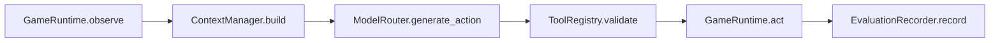

# Week 3 Development Document

## Goal

Week 3 connects the first single-agent execution loop: the backend can observe the Minecraft runtime, build model context with local knowledge, ask `qwen3.7-plus` through a model router, validate one structured harness action, dispatch it to the Mineflayer worker, and record an auditable trajectory.

The key design boundary is unchanged: the model is not allowed to generate raw Mineflayer JavaScript. It must return one `HarnessAction` JSON object.

## Delivered Changes

- Added OpenAI-compatible `ModelRouter` support:
  - default model comes from `MODEL_DEFAULT`, with `qwen3.7-plus` as the project default;
  - `QWEN_BASE_URL` and `QWEN_API_KEY` are read from environment settings;
  - provider responses are parsed into `HarnessAction`;
  - token usage and raw provider response metadata are preserved for audit.
- Added strict model output parsing:
  - accepts plain JSON such as `{"type":"query_inventory","args":{}}`;
  - tolerates a simple Markdown JSON code fence;
  - rejects raw code or invalid action JSON through `ModelRouterError`.
- Upgraded `ContextManager`:
  - injects the system prompt;
  - includes task spec, current observation, and task-scoped memory;
  - resolves Minecraft terms through `StaticKnowledgeProvider`;
  - injects recipe hints and local Mineflayer/Minecraft guide snippets;
  - returns retrieval metadata for trajectory audit.
- Upgraded `ToolRegistry`:
  - exposes a deterministic action allowlist to the prompt;
  - validates model actions before runtime dispatch;
  - supports task-local action scopes through `task_spec.allowed_actions`.
- Implemented `ExecutionLoop`:
  - `reset -> observe -> context -> model -> validate -> act -> record`;
  - records `run_started`, `observation`, `context_built`, `model_action`, `invalid_action`, `action_result`, and `run_finished`;
  - returns an `ExecutionRunResult` with per-step action and runtime result data.
- Added an in-memory `EvaluationRecorder` for Week 3 audit tests.
- Added a narrow worker-side `mine_block` attempt:
  - finds one nearby block by name;
  - calls `bot.dig` only if the block is currently diggable;
  - does not do pathfinding, collectBlock, crafting, or recovery planning.

## Single-Agent Flow



The model sees a JSON context payload with:

- `task`: task id, goal, optional allowed actions.
- `observation`: health, food, inventory, nearby blocks/entities.
- `task_memory`: task-local notes from prior attempts.
- `resolved_terms`: canonical Minecraft IDs and recipe hints.
- `retrieved_docs`: local guide snippets from the deterministic knowledge file.
- `action_contract`: allowed action names and output rules.

## Action Scope

Week 3 default action scope is intentionally small:

- `query_inventory`
- `request_visual_snapshot`
- `mine_block`

For task-specific runs, pass:

```python
task_spec = {
    "goal": "Check inventory before mining.",
    "allowed_actions": ["query_inventory"]
}
```

If the model returns `mine_block` under that scope, the loop records `invalid_action` and asks the model to repair the output into an in-scope action. If repair still fails, the harness uses an in-scope safe fallback or terminates the run. The out-of-scope action is never sent to Mineflayer.

## Output Repair and Safe Fallback

Week 3 now includes a harness-side `ActionRepairPolicy`. If the model output is not valid JSON, does not match the `HarnessAction` schema, or requests an action outside the current scope, the bad output cannot reach the Mineflayer worker.

Processing order:

- The first bad output records `model_error` or `invalid_action`.
- The harness appends a constrained repair prompt that asks the model to return one JSON action from `allowed_actions`.
- Repair attempts are recorded as `model_repair_attempt`.
- Successful repair is recorded as `model_repair_success`, followed by the final `model_action`.
- If repair still fails and the current scope permits a safe action, the harness falls back to `query_inventory` or `request_visual_snapshot` and records `model_fallback_action`.
- If no in-scope safe fallback exists, the harness records `model_repair_exhausted` and terminates the run.

The point is not to let the model bypass task scope. The point is to repair format instability or fail safely before runtime dispatch.

## Manual Use

Configure the Qwen-compatible endpoint:

```bash
export MODEL_DEFAULT=qwen3.7-plus
export QWEN_BASE_URL=https://dashscope.aliyuncs.com/compatible-mode/v1
export QWEN_API_KEY=replace-me
```

The recommended path is the project demo script. First start the Mineflayer worker:

```bash
./scripts/dev-worker.sh
```

Make sure Minecraft is in a single-player world with LAN enabled, then note the LAN port. In another terminal, run the inventory demo:

```bash
PYTHONPATH=backend/src /Users/zmchen/.cache/codex-runtimes/codex-primary-runtime/dependencies/python/bin/python3 \
  scripts/demo_week3_agent.py \
  --task inventory \
  --host localhost \
  --port 25565 \
  --username HarnessAgent
```

For the minimal mining demo, place or spawn the bot within 6 blocks of an `oak_log`, then run:

```bash
PYTHONPATH=backend/src /Users/zmchen/.cache/codex-runtimes/codex-primary-runtime/dependencies/python/bin/python3 \
  scripts/demo_week3_agent.py \
  --task mine-log \
  --host localhost \
  --port 25565 \
  --username HarnessAgent
```

The script calls Qwen for real and writes the audit trajectory to ignored path `runs/week3_demo_<timestamp>.json`. The printed `action` is the model output after harness validation, and `action_result` is the Mineflayer worker result.

Create a loop with a live `MineflayerClient`:

```python
from mc_agent_harness.harness.execution_loop import ExecutionBudget, ExecutionLoop
from mc_agent_harness.models.router import ModelRouter
from mc_agent_harness.runtime.mineflayer_client import MineflayerClient

runtime = MineflayerClient("ws://localhost:8765")
loop = ExecutionLoop(runtime=runtime, model_router=ModelRouter(), budget=ExecutionBudget(max_steps=1))

result = await loop.run(
    "inspect_inventory",
    task_spec={
        "goal": "Check inventory.",
        "runtime": {"host": "localhost", "port": 25565, "username": "HarnessAgent"},
        "allowed_actions": ["query_inventory"]
    },
    task_memory=[]
)
```

For a simple mining attempt:

```python
result = await loop.run(
    "mine_nearby_log",
    task_spec={
        "goal": "Mine one nearby oak log.",
        "runtime": {"host": "localhost", "port": 25565, "username": "HarnessAgent"},
        "allowed_actions": ["mine_block"]
    },
    task_memory=[]
)
```

The Week 3 `mine_block` implementation is deliberately minimal. Robust navigation, collection, crafting, placement, combat, timeouts, and recoverable error taxonomy remain Week 5 work.

## Tests Added

- `test_model_router.py`
  - validates JSON action parsing;
  - validates Markdown-fenced JSON parsing;
  - rejects raw code.
- `test_context_manager.py`
  - verifies term resolution, recipe hints, retrieved docs, and action contract injection.
- `test_tool_registry.py`
  - accepts enabled actions;
  - rejects disabled actions.
- `test_execution_loop.py`
  - runs one audited inventory step against a fake runtime;
  - dispatches an allowed `mine_block` attempt against a fake runtime;
  - rejects a scoped-out `mine_block` before runtime dispatch.

## Verification

Backend unit tests:

```bash
PYTHONPATH=backend/src /Users/zmchen/.cache/codex-runtimes/codex-primary-runtime/dependencies/python/bin/python3 -m pytest backend/tests/unit
```

Current result:

- Backend unit tests passed: 15 tests.

Full local CI:

```bash
PYTHON=/Users/zmchen/.cache/codex-runtimes/codex-primary-runtime/dependencies/python/bin/python3 make ci
```

## Current Boundaries

- Week 3 CI uses fake model providers, so it does not spend Qwen API tokens.
- The real Qwen call path is implemented through an OpenAI-compatible chat completions adapter, but a live API smoke test requires valid `QWEN_BASE_URL` and `QWEN_API_KEY`.
- Audit events are stored in memory for Week 3. PostgreSQL persistence starts in Week 4.
- `mine_block` is only a nearby-block dig attempt. Full Mineflayer action capability expansion remains Week 5.
