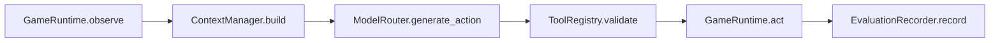

# Week 3 开发文档

## 目标

Week 3 打通第一个单 agent 执行闭环：backend 可以观察 Minecraft runtime，用本地知识库构造模型上下文，通过 `ModelRouter` 调用 `qwen3.7-plus`，校验模型输出的结构化 harness action，把 action 分发给 Mineflayer worker，并记录完整可审计轨迹。

核心边界不变：模型默认不能生成 raw Mineflayer JavaScript，只能返回一个 `HarnessAction` JSON 对象。

## 已交付变更

- 新增 OpenAI-compatible `ModelRouter`：
  - 默认模型来自 `MODEL_DEFAULT`，项目默认值是 `qwen3.7-plus`；
  - 从环境变量读取 `QWEN_BASE_URL` 和 `QWEN_API_KEY`；
  - 将 provider 返回内容解析为 `HarnessAction`；
  - 保留 token usage 和原始 provider response metadata，后续用于审计和成本统计。
- 新增严格的模型输出解析：
  - 支持普通 JSON：`{"type":"query_inventory","args":{}}`；
  - 容忍简单 Markdown JSON code fence；
  - raw code 或非法 action JSON 会被 `ModelRouterError` 拒绝。
- 升级 `ContextManager`：
  - 注入 system prompt；
  - 注入 task spec、当前 observation 和 task-scoped memory；
  - 通过 `StaticKnowledgeProvider` 解析 Minecraft 专有名词；
  - 注入 recipe hints 和本地 Minecraft/Mineflayer guide snippets；
  - 返回检索元数据，方便写入 trajectory audit。
- 升级 `ToolRegistry`：
  - 将确定性的 action allowlist 暴露给 prompt；
  - 在 runtime dispatch 前校验模型 action；
  - 支持通过 `task_spec.allowed_actions` 设置任务级 action scope。
- 实现 `ExecutionLoop`：
  - `reset -> observe -> context -> model -> validate -> act -> record`；
  - 记录 `run_started`、`observation`、`context_built`、`model_action`、`invalid_action`、`action_result`、`run_finished`；
  - 返回 `ExecutionRunResult`，包含每一步的 action 和 runtime result。
- 新增 Week 3 版内存型 `EvaluationRecorder`，用于测试阶段审计。
- 在 worker 侧新增很窄的 `mine_block` attempt：
  - 按方块名寻找一个近距离方块；
  - 只有当前可挖时才调用 `bot.dig`；
  - 不做 pathfinding、collectBlock、合成、恢复规划。

## 单 Agent 流程



模型看到的是 JSON context payload：

- `task`：task id、goal、可选 allowed actions。
- `observation`：health、food、inventory、nearby blocks/entities。
- `task_memory`：当前任务独立的历史经验。
- `resolved_terms`：canonical Minecraft IDs 和 recipe hints。
- `retrieved_docs`：来自确定性本地知识库的 guide snippets。
- `action_contract`：允许调用的 action 名称和输出规则。

## Action Scope

Week 3 默认 action scope 很小：

- `query_inventory`
- `request_visual_snapshot`
- `mine_block`

任务运行时可以进一步收窄：

```python
task_spec = {
    "goal": "Check inventory before mining.",
    "allowed_actions": ["query_inventory"]
}
```

如果模型在这个 scope 下返回 `mine_block`，执行循环会先记录 `invalid_action`，再尝试让模型修复为 scope 内 action；如果修复仍失败，会降级到 scope 内安全动作或终止 run，不会把越权动作发给 Mineflayer runtime。

## 输出修复与安全降级

Week 3 现在包含 harness 侧 `ActionRepairPolicy`。如果模型输出不是合法 JSON、JSON 不符合 `HarnessAction` schema，或者 action 不在当前 scope 内，坏输出不会进入 Mineflayer worker。

处理顺序：

- 首次坏输出会记录 `model_error` 或 `invalid_action`。
- harness 会追加一个 constrained repair prompt，要求模型只在 `allowed_actions` 内返回一个 JSON action。
- repair 尝试记录为 `model_repair_attempt`。
- repair 成功记录为 `model_repair_success`，随后记录最终 `model_action`。
- repair 仍失败时，如果当前 scope 允许安全动作，会降级为 `query_inventory` 或 `request_visual_snapshot`，并记录 `model_fallback_action`。
- 如果没有 scope 内安全 fallback，会记录 `model_repair_exhausted` 并终止 run。

这个策略的目标不是让模型越权完成任务，而是让 runtime 在模型格式不稳定时可审计地修复或安全失败。

## 手动使用

先配置 Qwen-compatible endpoint：

```bash
export MODEL_DEFAULT=qwen3.7-plus
export QWEN_BASE_URL=https://dashscope.aliyuncs.com/compatible-mode/v1
export QWEN_API_KEY=replace-me
```

推荐用项目内 demo 脚本跑最小真实链路。先启动 Mineflayer worker：

```bash
./scripts/dev-worker.sh
```

确保 Minecraft 已进入单人世界并开启 LAN，记下 LAN 端口。另开终端执行 inventory 查询 demo：

```bash
PYTHONPATH=backend/src /Users/zmchen/.cache/codex-runtimes/codex-primary-runtime/dependencies/python/bin/python3 \
  scripts/demo_week3_agent.py \
  --task inventory \
  --host localhost \
  --port 25565 \
  --username HarnessAgent
```

如果要测试最小挖掘 demo，需要把 bot 放在或出生在 `oak_log` 附近 6 格内，然后执行：

```bash
PYTHONPATH=backend/src /Users/zmchen/.cache/codex-runtimes/codex-primary-runtime/dependencies/python/bin/python3 \
  scripts/demo_week3_agent.py \
  --task mine-log \
  --host localhost \
  --port 25565 \
  --username HarnessAgent
```

脚本会真实调用 Qwen，并把审计轨迹写入 ignored 的 `runs/week3_demo_<timestamp>.json`。输出中的 `action` 是模型返回并通过 harness 校验的动作，`action_result` 是 Mineflayer worker 返回的执行结果。

用 live `MineflayerClient` 创建执行循环：

```python
from mc_agent_harness.harness.execution_loop import ExecutionBudget, ExecutionLoop
from mc_agent_harness.models.router import ModelRouter
from mc_agent_harness.runtime.mineflayer_client import MineflayerClient

runtime = MineflayerClient("ws://localhost:8765")
loop = ExecutionLoop(runtime=runtime, model_router=ModelRouter(), budget=ExecutionBudget(max_steps=1))

result = await loop.run(
    "inspect_inventory",
    task_spec={
        "goal": "Check inventory.",
        "runtime": {"host": "localhost", "port": 25565, "username": "HarnessAgent"},
        "allowed_actions": ["query_inventory"]
    },
    task_memory=[]
)
```

简单挖掘尝试：

```python
result = await loop.run(
    "mine_nearby_log",
    task_spec={
        "goal": "Mine one nearby oak log.",
        "runtime": {"host": "localhost", "port": 25565, "username": "HarnessAgent"},
        "allowed_actions": ["mine_block"]
    },
    task_memory=[]
)
```

Week 3 的 `mine_block` 是最小实现。稳定导航、资源收集、合成、放置、战斗、超时治理、可恢复错误分类仍然属于 Week 5。

## 新增测试

- `test_model_router.py`
  - 校验 JSON action parsing；
  - 校验 Markdown-fenced JSON parsing；
  - 拒绝 raw code。
- `test_context_manager.py`
  - 验证术语解析、recipe hints、retrieved docs 和 action contract 注入。
- `test_tool_registry.py`
  - 接受 enabled action；
  - 拒绝 disabled action。
- `test_execution_loop.py`
  - 使用 fake runtime 跑一轮可审计 inventory 查询；
  - 使用 fake runtime 分发一个允许的 `mine_block` attempt；
  - 在 action scope 外拒绝 `mine_block`，且不会 dispatch 到 runtime。

## 验证

后端单元测试：

```bash
PYTHONPATH=backend/src /Users/zmchen/.cache/codex-runtimes/codex-primary-runtime/dependencies/python/bin/python3 -m pytest backend/tests/unit
```

当前结果：

- Backend unit tests passed：15 个 tests。

完整本地 CI：

```bash
PYTHON=/Users/zmchen/.cache/codex-runtimes/codex-primary-runtime/dependencies/python/bin/python3 make ci
```

## 当前边界

- Week 3 CI 使用 fake model provider，不消耗 Qwen API token。
- 真实 Qwen 调用路径已通过 OpenAI-compatible chat completions adapter 实现，但 live API smoke test 需要有效的 `QWEN_BASE_URL` 和 `QWEN_API_KEY`。
- 审计事件 Week 3 仍保存在内存；PostgreSQL 持久化从 Week 4 开始。
- `mine_block` 只是近距离方块挖掘尝试。完整 Minecraft 动作能力扩展仍在 Week 5。
